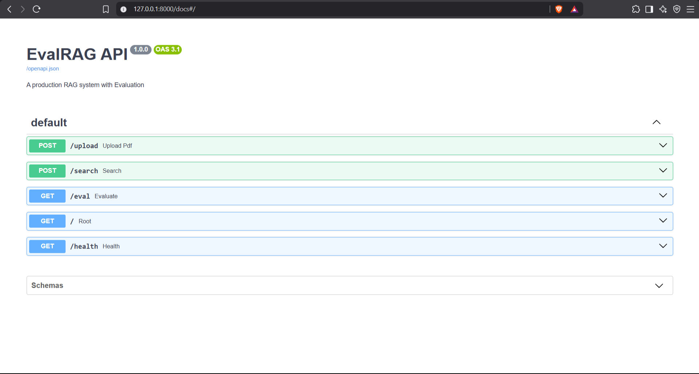
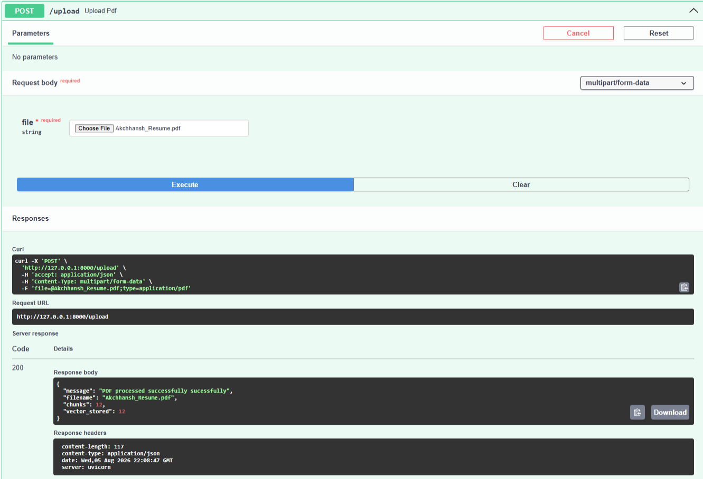
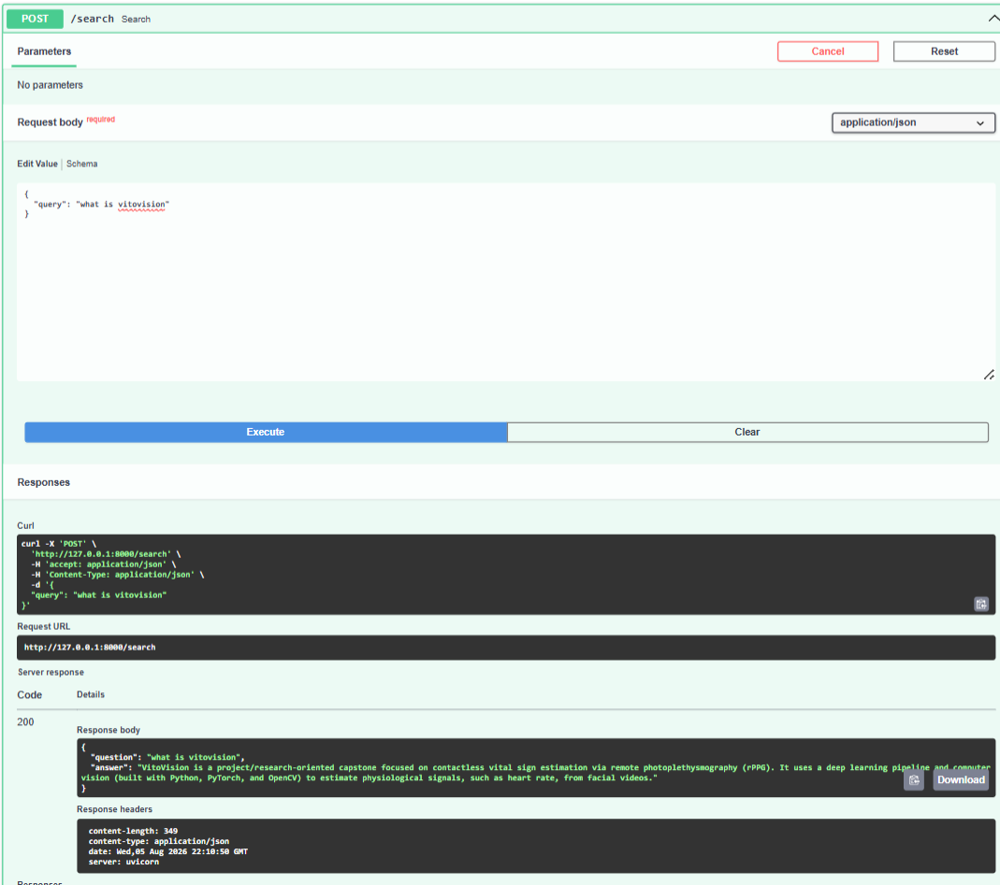

# 🚀 EvalRAG

> A Production-Ready Retrieval-Augmented Generation (RAG) System with an Integrated Evaluation Pipeline.

EvalRAG enables users to upload PDF documents, retrieve semantically relevant information using a vector database, generate grounded responses with Google's Gemini API, and automatically evaluate answer quality using a Golden Dataset and LLM-as-a-Judge.

---

## ✨ Features

- 📄 Upload PDF documents
- ✂️ Automatic text extraction and chunking
- 🧠 Sentence Transformer embeddings
- 🗄️ Qdrant Vector Database
- 🔍 Semantic Search
- 🤖 Gemini-powered Answer Generation
- 📊 Built-in Evaluation Pipeline
- 🐳 Dockerized Qdrant
- ⚡ FastAPI REST API
- 📖 Interactive Swagger Documentation

---

# 🏗️ Architecture

<p align="center">
  
</p>

---

# 📸 Project Demo

## Swagger UI

<p align="center">
  
</p>

---

## Upload PDF

<p align="center">
  
</p>

---

## Semantic Search

<p align="center">
  
</p>

---

# ⚙️ Tech Stack

| Category | Technologies |
|-----------|--------------|
| Backend | FastAPI |
| Programming Language | Python |
| Vector Database | Qdrant |
| Embedding Model | Sentence Transformers |
| LLM | Google Gemini |
| PDF Processing | PyMuPDF |
| API Server | Uvicorn |
| Containerization | Docker & Docker Compose |

---

# 📂 Project Structure

```text
EvalRAG
│
├── app
│   ├── models
│   ├── routes
│   │   ├── upload.py
│   │   ├── search.py
│   │   └── eval.py
│   │
│   ├── services
│   │   ├── chunk_service.py
│   │   ├── embedding_service.py
│   │   ├── pdf_service.py
│   │   ├── qdrant_service.py
│   │   ├── search_service.py
│   │   ├── llm_service.py
│   │   ├── rag_service.py
│   │   └── eval_service.py
│   │
│   └── utils
│
├── data
│   ├── uploads
│   ├── processed
│   └── evaluation
│
├── docs
│   ├── architecture.png
│   ├── swagger-ui.png
│   ├── upload.png
│   └── search.png
│
├── eval
│   └── golden_dataset.json
│
├── docker-compose.yml
├── requirements.txt
├── README.md
└── main.py
```

---

# ⚡ Installation

Clone the repository

```bash
git clone https://github.com/Akchhansh/EvalRAG.git
```

Move into the project

```bash
cd EvalRAG
```

Create virtual environment

```bash
python -m venv .venv
```

Activate

Windows

```bash
.venv\Scripts\activate
```

Linux / macOS

```bash
source .venv/bin/activate
```

Install dependencies

```bash
pip install -r requirements.txt
```

---

# 🔑 Environment Variables

Create a `.env` file

```env
GEMINI_API_KEY=YOUR_API_KEY
```

---

# 🐳 Run Qdrant

```bash
docker compose up -d
```

Verify

```bash
docker ps
```

---

# 🚀 Start FastAPI

```bash
uvicorn main:app --reload
```

Swagger UI

```
http://127.0.0.1:8000/docs
```

---

# 📡 API Endpoints

| Method | Endpoint | Description |
|----------|-------------|-----------------------------|
| POST | `/upload` | Upload a PDF document |
| POST | `/search` | Ask questions using RAG |
| GET | `/eval` | Run evaluation pipeline |
| GET | `/health` | Health check |

---

# 📊 Evaluation Pipeline

The evaluation pipeline works as follows:

```
Golden Dataset
        │
        ▼
Question
        │
        ▼
RAG Pipeline
        │
        ▼
Generated Answer
        │
        ▼
Gemini (LLM Judge)
        │
        ▼
Accuracy Report
```

---

# 🔮 Future Improvements

- Hybrid Search
- Metadata Filtering
- Cloud Qdrant Deployment
- PostgreSQL Support
- Authentication & Authorization
- Conversation Memory
- Streaming Responses
- RAGAS Integration

---

# 👨‍💻 Author

**Akchhansh**

GitHub

https://github.com/Akchhansh

---

## ⭐ If you found this project useful, consider giving it a Star!